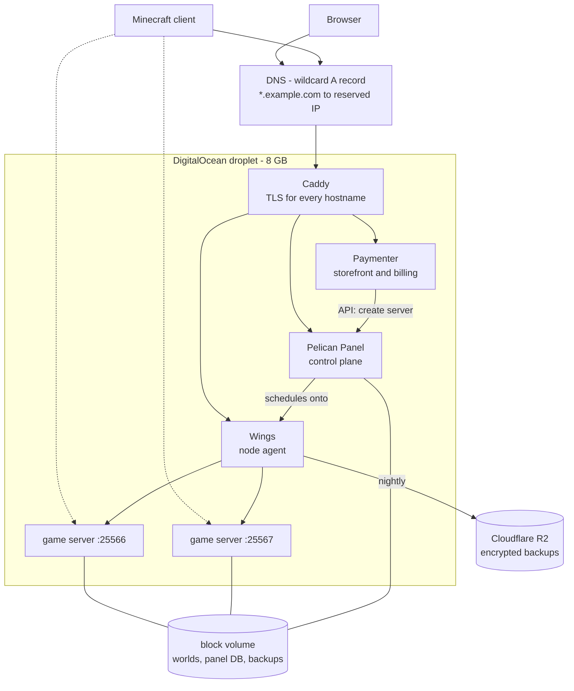

# Game Server Factory

[](https://github.com/madhawk1296/game-server-factory/actions/workflows/ci.yml)

Automated Minecraft server hosting. A customer picks a plan, and a working,
internet-reachable game server exists a few minutes later without anyone
touching it.

Terraform provisions the node -- droplet, block storage, firewall, DNS, TLS,
monitoring -- and a control plane schedules game servers onto it. The two layers
are deliberately separate: Terraform owns what changes when *you* decide, and the
control plane owns what changes when *anyone else* acts.

---

## Architecture



One host answers on one name for three different things: the bare domain is a
shop in a browser and a game server in a Minecraft client, because they are
different ports and a client only ever tries one.

---

## Layout

```
cloud/host      the node: droplet, volume, firewall, reserved IP, DNS, cloud-init
cloud/panel     Pelican Panel
cloud/billing   Paymenter, MariaDB, Redis
modules/worlds  the hand-built orchestration layer, now local development only
local           the local stack -- a full environment on Docker Desktop
```

The node and its workloads are separate roots because Terraform configures
providers before it creates resources, so a provider cannot depend on an IP that
does not exist yet. The split is forced, but it lands on the right shape anyway:
infrastructure below, workloads above.

---

## Design decisions

**Data outlives its container, and the machine is disposable.** Worlds live on a
block volume; Docker's data-root points at it, so every named volume lands on
durable storage without the application knowing. Destroying and rebuilding the
droplet is a routine three-minute operation. Verified by doing it -- placing an
unsaved block in a live world, destroying the machine, and checking the block
came back.

**The address belongs to the account, not the machine.** A reserved IP plus a
single wildcard DNS record means a rebuild never touches DNS and no saved client
entry breaks. Adding the tenth server requires no DNS change, because the
wildcard already covers it.

**Routing is a naming problem, so DNS solves it.** An earlier version put
mc-router in the data path to read the hostname out of Minecraft's handshake. It
worked, but it made every server's availability depend on one process. SRV
records do the same job with no proxy, no extra hop, and nothing to fail --
Minecraft's protocol was designed for it.

**Memory ceilings derive from measurement.** Container limits are hard, swap is
disabled -- a swapping tick loop stutters rather than degrading -- and CPU is a
share weight rather than a quota, because a hard cap throttles ticks even on an
idle host. The JVM heap is computed from the container ceiling so the two cannot
be set inconsistently.

**Adopt, do not build.** modules/worlds was a working orchestration layer:
for_each over a map of worlds, per-world isolation, lifecycle states, encrypted
deduplicated backups, a deliberate decommissioning path. It was replaced by
Pelican, which does all of that plus a console, file manager, SFTP, and
multi-node scheduling. Roughly 950 lines were retired. That was the right trade,
and building it first is why Pelican's design reads as obvious rather than
arbitrary.

---

## What running it proved

Nine faults reached production-shaped code and were only caught by executing it.
None were visible to code review.

**The sizing model was wrong.** Non-heap JVM memory measured ~440 MB at both a
4096 MB and a 2457 MB heap, so the reserve was modelled as a fixed cost. Under
real uptime at a 4352 MB heap it reached 693 MB -- part of it scales with heap,
just not enough to notice at the sizes first tested. The server was sitting at
98.5% of its ceiling, about 75 MB from an OOM kill.

**Adopting a tool does not inherit your guarantees.** Pelican's defaults put
server data, the node's identity, and every backup on the droplet's ephemeral
disk, while Docker's data sat safely on the block volume beside them. Three
separate bind mounts had to be re-applied to restore a property the architecture
already had.

**Six faults surfaced the first time an order provisioned a server**, each of
which would have hit the first paying customer: disk exhaustion from a server
reserving 10 GB to store 18 MB; allocations still naming a reserved IP that had
changed during a mothball, because DNS updated itself and the allocation table
did not; all eleven ports bound to one server; an egg that writes eula.txt
without agreeing to it, so every provisioned server started and immediately
exited; MaxRAMPercentage=95 living in the egg, so fixing one server fixed
nothing; and a firewall permitting only one of the eleven allocatable ports.

**Two tests were lying.** One asserted a world survived a container replacement
that never happened, because the resource address had changed and -replace
silently matched nothing. Another reported a server ready five seconds into a
reboot, because container logs survive a restart and it was reading the previous
boot's output.

---

## Testing

```bash
cd local
./test.sh          # 21 checks
./test.sh --full   # 28, including a container replace and a stop/start cycle
```

The suite stands up two worlds, a router, and object storage, then asserts
behaviour: worlds are isolated at identical coordinates, hostname routing reaches
the right backend and refuses unknown names, memory limits are enforced by
cgroups, unsaved state survives a container replacement, and a backup restores to
a usable world.

CI runs fmt and validate across all five roots, then stands the local stack up on
real Docker inside the runner and runs the same suite on every push. Cloud roots
are validated but never applied -- that would need credentials and would create
billable infrastructure per push.

---

## Running it

**Locally** -- needs Docker Desktop and Terraform:

```bash
cd local && terraform init && terraform apply
```

Two worlds, a router, and MinIO standing in for object storage. Reachable at
localhost:25566, or by hostname with the /etc/hosts line the root outputs.

**On a droplet** -- needs a DigitalOcean token and a domain delegated to their
nameservers:

```bash
cd cloud/host && terraform apply     # node, volume, firewall, DNS, TLS
cd ../panel   && terraform apply     # control plane
cd ../billing && terraform apply     # storefront
```

Roughly five minutes. The panel and storefront then need an admin account created
through their own installers.

---

## Operations

**Teardown order matters.** Destroying the host while worlds are running is a
hard power-off -- Paper never receives SIGTERM and anything since its last
autosave is lost. Stop the containers first, then the machine.

**Mothballing.** Destroying the droplet while keeping the volume drops the bill
from ~$50/month to $2. Everything restores with terraform apply -- the world, the
panel's database, the storefront's products, and the node's identity all live on
the volume. The IP changes and nothing cares, because DNS is managed in code.

**Deleting a world is deliberately not a config edit.** Volumes carry
prevent_destroy, which Terraform requires to be a literal, so it cannot be
relaxed per world. Removing a map entry therefore aborts the whole plan rather
than deleting data. Retirement is a five-step runbook that names the world
explicitly on the command line twice.

---

## Economics

The plans -- 2/4/8/12 GB at $6/$10/$18/$26 -- are priced against the market, not
against the bill, because on this hardware the bill cannot be covered. The
droplet costs $51/month and yields about 4.8 GB of sellable memory after the
panel, storefront, database, cache, agent and OS: roughly **$10.60 per sellable
GB** against a market rate of $2-5.

A 64 GB dedicated server at around $115/month leaves ~54 GB sellable, or about
$2.13/GB, at which the same prices carry margin and break even near 60%
occupancy. The architecture ports to it unchanged. That is a purchasing decision
rather than an engineering one, and it is the only number in the project that
decides whether it is a business or a demonstration.

---

## Known limitations

Deliberate, for a one-operator project, and each is the first thing to change
under different circumstances:

- **One node, no failover.** If it dies, every server is down.
- **Terraform state is local.** Losing it orphans resources that keep billing;
  the configs are in git, so nothing is unrecoverable, but reconciliation would
  be manual.
- **Credentials live in gitignored tfvars**, not a secrets manager.
- **The control plane's configuration is click-ops.** Nodes, backup hosts and
  schedules live in Pelican's database with no source of truth outside it.
- **Provisioning does not create DNS records or backup schedules.** Both are
  per-server steps that must happen at creation or silently never happen.
- **No capacity automation.** When the node fills, provisioning fails at
  checkout; nothing adds a node.
